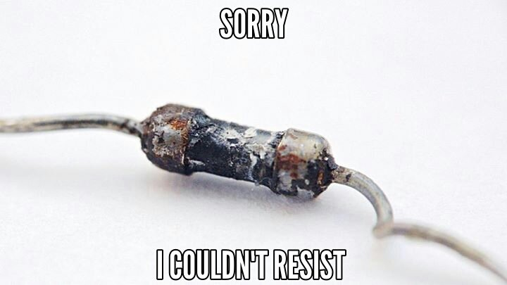

## Getting Started

###Some things we'll need:

- Arduino compatible micro-controller ([here's mine](http://www.amazon.com/dp/B00E5WJSHK/ref=cm_sw_r_tw_dp_H8lvxb1224T12))
- Arduino IDE (to install Standard Firmata)
 - [Download](https://www.arduino.cc/en/Main/Software) it from Arduino.cc
 - I used Choclatey.org (choco install arduino)
- Visual Studio 2015
- CLONE this repo (I use submodules so a .ZIP download isn't going to cut it ;) )
  - Don't forget to do this (unless you are using a rockin' tool like GitKraken)
    - git submodule update --init --recursive
- You should probably go ahead and learn Ohm's law:

    _Twinkle, twinkle little start V is equal to IR (V=IR), up above the sky so high, P is equal to VI (P=VI)_
    
    _Add resistors in series: R = R1 + R2 + R3_
    
    _Inversely add them in parallel: 1/R = 1/R1 + 1/R2 + 1/R3_

- Let the resistor take the hit for you:

**These won't be needed at the user group meeting but they are here for your reference!**

### [NEXT: What's an Arduino? >>](GettingStarted_2.md)

[TOP](README.md)