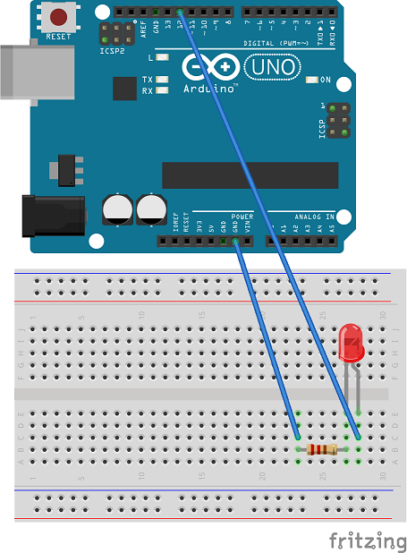

## Getting Started

### What's an Arduino?

- An open source hardware specification
- A prototyping platform
- Damn cheap! (like $5 cheap.  $12 for a more spacious version. $25 version supports Arduino)
- Crazy easy to program (AVR-C is way simple, we'll use C#)\
- Or program one graphically with ArduBlock and ModKit (and other Blockly GDEs)

_**DEMO 1 - Blinky!**_  - [Code Here](https://github.com/JAgostoni/pgh-dot-net-remote-wiring/tree/wip/Demo%201%20-%20Simple%20Arudino/flashy)

Just a simple demo showing how easy programming an Arduino is!

Do this:

1. Wire up your Arudino similar to the diagram above
2. Open the Arduino IDE, start a new sketch
3. In the setup() method, set the pinMode to OUTPUT
4. In the loop() method, alternate the state of the pin with delays

Does it look like this?

### [NEXT: What's StandardFirmata? >>](GettingStarted_3.md)

[TOP](README.md)