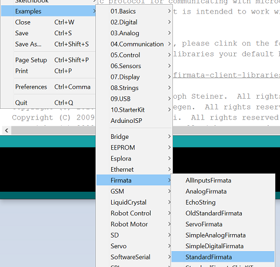

## Getting Started

### What's StandardFirmata?
Standardized protocol for communicating with microcontrollers from more general purpose computers (like your PC, Mac, RaspberryPi).

- Based on the MIDI format (really? cool!)
- Client libraries available in just about every language
- Easily uploaded to your arduino

_**DEMO 2: Uploading Standard Firmata**_

Get the StandardFirmata uploaded to the board.

Do this:

1. Connect your board
2. Open the Arduino IDE
3. Ensure you're board and port are selected (Tools->Board, Tools->Port)
4. Open the StandardFirmata sketch (File->Examples->Firmata->StandardFirmata)
5. Upload. Done.

**Now we can get started with C#!** 

### [NEXT: Microsoft Remote Wiring >>](msiotwiring_1.md)

[TOP](README.md)
