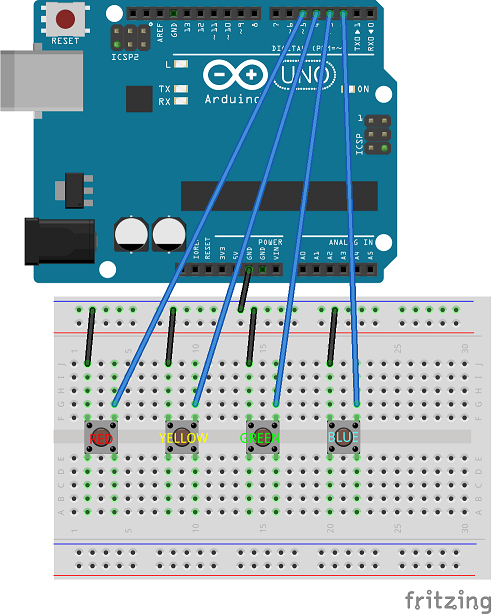

## End-to-End: Button/Band IoT Project

### A fun example: Button/Band IoT

We (at CEI) started this little demonstration project to show people how easy it can be to create an fully end-to-end
solution for capturing sensor data and displaying it.

**Components of the project:**

- Windows UWP app collecting button data, and presenting current counts
- Azure IoT hub for securely sending telemetry events (button presses) to the cloud
- ASP.NET WebAPI service for collecting and serving up the counts'
- Microsoft Band WebTile for showing the data on my wrist

_**DEMO 7: The whole deal!**_

The project is availble here for perusal: https://github.com/JAgostoni/button-band-iot

I created the WebTile in just a few minutes here: https://developer.microsoftband.com/WebTile/ChooseLayout

### [NEXT: Wrap Up >>](wrapup.md)

[TOP](README.md)
