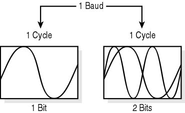

## Microsoft Remote Wiring

### Serial Wiring

The Serial-Wiring framework provides an Arduino compatible stream layer over USB, Bluetooth and Network connected Arduinos.
This provides the foundation for implementing serial-based protocols (you know, like Firmata) when communicating with your
microcontroller.  If you have your own custom serial protocol, this layer is where you will start.

It is *IMPORTANT* to know the bitrate (bps) that is set in the Standard Firmata that you uploaded to your board.  But it's probably 57600 bps.



_**DEMO 4: Finding and connecting to the board**_

You _could_ harccode the COM port of your device ... OR we can steal code from the Internet to search for it ;)

1. Use the solution from Demo 3, or open the [Starter Solution](https://github.com/JAgostoni/pgh-dot-net-remote-wiring/tree/master/Demo4/Starter/)
2. Open the MainPage.xaml.cs code file, uncomment the block of code for the FindFirstArduinoBoard method
3. In the Button_Click event, call that method and create a new UsbSerial object with the result
  - You should make this a private member var/property, we will need ot later
4. Wire up to the ConnectionEstablished and ConnectionFailed events and Debug.WriteLine inside the handlers
5. Call the begin() method with the correct _bitrate_
6. Run the project and click the connect button

Did it work?  Of course not! You got a Catastrophic Failure too? 


Riiight, we need to give the UWP app permissions to connect
to the serial devices.  Wait? No UI support for this? Well, time to edit some XML...

1. Open the .appxmanifest using the XML editor (Right-Click->Open With...)
2. Make sure your capabilities section looks like the snippet below
3. Try again

```xml
<Capabilities>
    <Capability Name="internetClient" />
    <Capability Name="privateNetworkClientServer" />
    <Capability Name="internetClientServer" />
    <DeviceCapability Name="bluetooth.rfcomm">
      <Device Id="any">
        <Function Type="name:serialPort" />
      </Device>
    </DeviceCapability>
    <DeviceCapability Name="serialcommunication">
      <Device Id="any">
        <Function Type="name:serialPort" />
      </Device>
    </DeviceCapability>
  </Capabilities>
```

**Did it work this time? Great! Moving up the layers ...**


### [NEXT: Firmata >>](msiotwiring_3.md)

[TOP](README.md)
